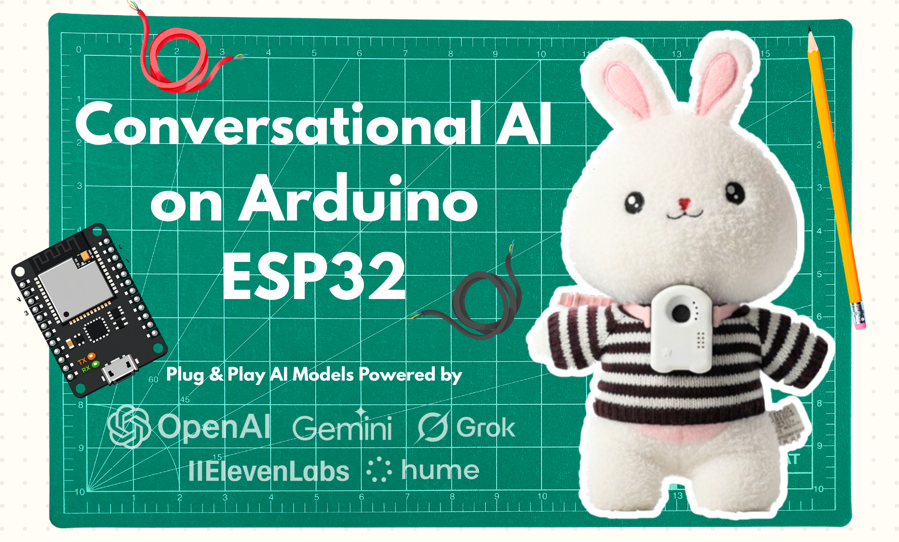
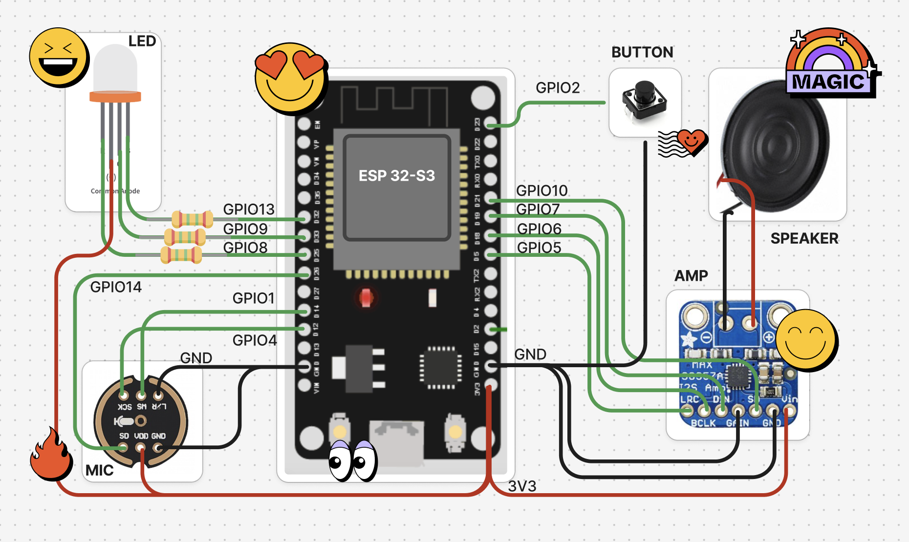
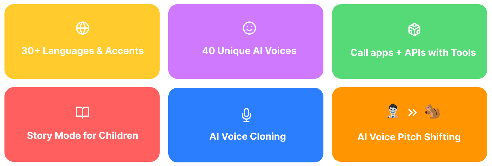
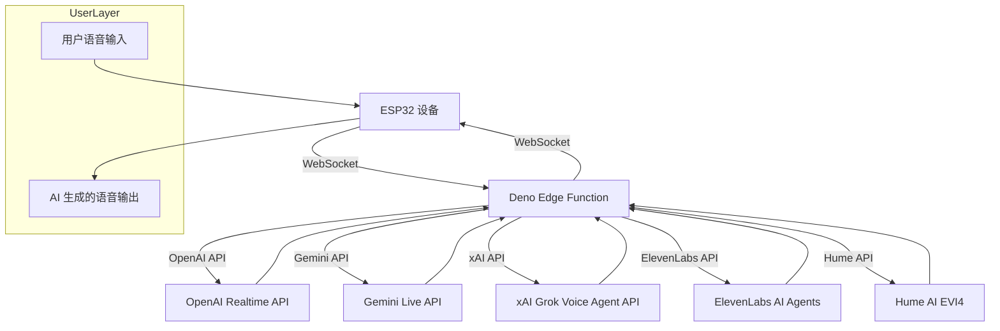
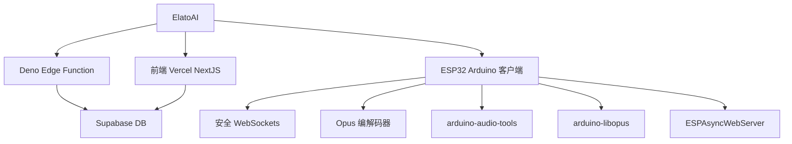

[English](README.md) | 中文

  <a href="https://elatoai.com"><picture>
    <source media="(prefers-color-scheme: dark)" srcset="assets/darkelato.png">
    <source media="(prefers-color-scheme: light)" srcset="assets/lightelato.png">
    
  </picture></a>
  

    
  
  
<!--  -->
      
 <!--  -->

 

## 新闻
- **2026-03-14：** Elato 刚刚发布了 Local AI Toys。🎉🎉🎉 而且今天还是 Pi Day！现在你的 ESP32 设备可以通过 MLX 支持本地 AI 模型和语音生成，配合 Qwen、Mistral 等前沿本地 LLM 和 TTS 模型。点击[这里](https://www.github.com/akdeb/local-ai-toys)查看。

# 👾 ElatoAI：在 Arduino ESP32 上运行实时语音 AI 模型

基于先进语音模型的实时 AI 语音系统，可运行在 ESP32 上，并通过安全 WebSocket 与 Deno Edge Functions 实现全球范围内超过 15 分钟的不间断对话。当前支持 OpenAI Realtime API、Gemini Live API、xAI Grok Voice Agents API、Eleven Labs Conversational AI Agents 和 Hume AI EVI-4。

- [🚀 快速开始](https://www.elatoai.com/docs/quickstart)
- [使用 PlatformIO 构建](https://www.elatoai.com/docs/platformio)
- [在 Arduino IDE 上构建](https://www.elatoai.com/docs/arduino)
- [全球部署](https://www.elatoai.com/docs/blog/deploying-globally)
- [🤖🤖🤖 部署多台设备](https://www.elatoai.com/docs/blog/multiple-devices)

## 📽️ 演示视频

    

视频链接：[OpenAI 演示](https://youtu.be/o1eIAwVll5I) | [Gemini 演示](https://youtu.be/_zUBue3pfVI) | [Eleven Labs 演示](https://youtu.be/7LKTIuEW-hg) | [Hume AI EVI-4 演示](https://youtu.be/Gtann5pdV0I)

## 👷‍♀️ DIY 硬件设计

## 📱 应用设计

通过 ElatoAI Web 应用，你可以直接在手机上控制自己的 ESP32 AI 设备。

## ⭐️ 语音 AI 关键特性

## 🌟 完整功能列表

1. **实时语音转语音**：基于 OpenAI Realtime API、Gemini Live API、xAI Grok Voice Agent API、Eleven Labs Conversational AI Agents 和 Hume AI EVI4 的即时语音转换。
2. **创建自定义 AI 智能体**：创建拥有不同个性和声音的自定义智能体。
3. **可定制语音**：从多种声音和人格中进行选择。
4. **安全 WebSocket**：可靠且加密的 WebSocket 通信。
5. **服务端 VAD 轮次检测**：智能处理对话轮次，让交互更流畅。
6. **Opus 音频压缩**：以极低带宽实现高质量音频流传输。
7. **全球边缘性能**：低延迟的 Deno Edge Functions 确保全球范围内的流畅对话。
8. **ESP32 Arduino 框架**：经过优化且易于使用的硬件集成方案。
9. **对话历史**：查看你的历史对话记录。
10. **设备管理与认证**：注册并管理你的设备。
11. **用户认证**：安全的用户认证与授权。
12. **通过 WebRTC 和 WebSocket 对话**：你可以在 NextJS Web 应用中通过 WebRTC 与 AI 对话，也可以在 ESP32 上通过 WebSocket 对话。
13. **音量控制**：在 NextJS Web 应用中控制 ESP32 扬声器的音量。
14. **实时转录**：你的对话实时转录内容会存储在 Supabase 数据库中。
15. **OTA 更新**：支持 ESP32 固件空中更新。
16. **通过 Captive Portal 管理 Wi-Fi**：在 ESP32 设备上连接到你的 Wi-Fi 网络或热点。
17. **恢复出厂设置**：通过 NextJS Web 应用对 ESP32 设备执行恢复出厂设置。
18. **按钮与触摸支持**：可使用按钮或触摸传感器来控制 ESP32 设备。
19. **无需 PSRAM**：ESP32 设备无需 PSRAM 即可运行语音转语音 AI。
20. **Web 客户端 OAuth**：为你的用户提供 OAuth，以管理他们的 AI 角色和设备。
21. **音高因子**：在 NextJS Web 应用中调节 AI 语音的音高，以创建更卡通化的声音。
22. **工具调用**：从 ESP32 设备调用 Deno Edge Functions 上的工具和函数，构建完整的语音 AI 智能体。
23. **轻触唤醒**：轻触触摸板即可从休眠中唤醒设备。

## 项目架构

ElatoAI 由三个主要组件构成：

1. **前端客户端**（部署在 Vercel 上的 `Next.js`）- 用于创建并与 AI 智能体对话，并将其“发送”到你的 ESP32 设备
2. **边缘服务函数**（运行在 Deno/Supabase Edge 上的 `Deno`）- 用于处理来自 ESP32 设备的 WebSocket 连接以及对 LLM 提供商 API 的调用
3. **ESP32 IoT 客户端**（`PlatformIO/Arduino`）- 用于接收来自边缘服务函数的 WebSocket 连接，并通过 Deno 边缘服务把音频发送给 LLM 提供商

## 🛠 技术栈

| 组件 | 使用的技术 |
|-----------------|------------------------------------------|
| 前端 | Next.js, Vercel |
| 后端 | Supabase DB |
| 边缘函数 | 运行于 Deno/Supabase 的 Deno Edge Functions |
| IoT 客户端 | PlatformIO, Arduino Framework, ESP32-S3 |
| 音频编解码 | Opus |
| 通信 | 安全 WebSockets |
| 库 | [ArduinoJson](https://github.com/bblanchon/ArduinoJson), [WebSockets](https://github.com/Links2004/arduinoWebSockets), [AsyncWebServer](https://github.com/ESP32Async/ESPAsyncWebServer), [ESP32_Button](https://github.com/esp-arduino-libs/ESP32_Button), [Arduino Audio Tools](https://github.com/pschatzmann/arduino-audio-tools), [ArduinoLibOpus](https://github.com/pschatzmann/arduino-libopus) |

## 高层流程图

## 项目结构

## 📊 关键指标

- **延迟**：全球往返延迟小于 2 秒
- **音频质量**：使用 12kbps Opus 编码（高清晰度），24kHz 采样率
- **不间断对话**：全球范围内支持最长 15 分钟连续对话
- **全球可用性**：通过边缘计算进行优化

## 🛡 安全性

- 使用安全 WebSocket（WSS）进行加密数据传输
- 可选：使用 256 位 AES 对 API Key 进行加密
- 使用 Supabase DB 进行安全认证
- 所有数据表均采用 Postgres RLS

## 🚫 限制
- 连接边缘服务器时有 3-4 秒冷启动时间
- 已测试最长连续对话时间约为 17 分钟
- 当超过墙钟时间限制时，边缘服务器会停止运行
- ESP32 上暂无语音打断检测

## 🙌 贡献

我们非常欢迎你的贡献！这里有一些可以参与的方向：
1. ESP32 上的语音打断（已支持 OpenAI）
2. ~~添加 Arduino IDE 支持~~
3. ~~添加用于情绪检测的 Hume API 客户端~~
4. 在 Deno Edge 上添加 MCP 支持
5. ~~接入 Eleven Labs API 进行语音生成~~
6. 添加 Azure OpenAI 支持（容易上手）- 审核中
7. 添加 Cartesia 支持
8. 添加 Amazon Nova 支持
9. 添加 Deepgram 支持

## 许可证

本项目基于 MIT License 发布，详情请参见 [LICENSE](LICENSE) 文件。

**欢迎查看我们的硬件产品：[ElatoAI Products](https://www.elatoai.com/)。如果你觉得这个项目有趣或有帮助，欢迎在 GitHub 上给这个项目点个 Star。⭐**
